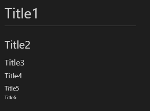

# 제목(Header)
제목은 `<h1> ~ <h6>`로 표현 가능하며, `#`의 개수로 단계를 나타낼 수 있습니다. 

CODE
```
# Title1
## Title2
### Title3
#### Title4
##### Title5
###### Title6
```


# BlockQuote(인용구)
`>` 을 사용하는 것이다.
```
>First blockquote
>   >Second blockquote
>   >   >Third blockquote
```
>First blockquote
>   >Second blockquote
>   >   >Third blockquote

# 목록
## 순서 있는 목록
```
1. First
2. Second
3. Third
```
1. First
2. Second
3. Third
