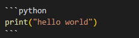

# 제목(Header)
제목은 `<h1> ~ <h6>`로 표현 가능하며, `#`의 개수로 단계를 나타낼 수 있습니다. 

_code_
```
# Title1
## Title2
### Title3
#### Title4
##### Title5
###### Title6
```
_preview_


# BlockQuote(인용구)
`>` 을 사용하는 것이다.

_code_
```
>First blockquote
>   >Second blockquote
>   >   >Third blockquote
```
_preview_
>First blockquote
>   >Second blockquote
>   >   >Third blockquote

# 목록
## 순서있는 목록
_code_
```
1. First
2. Second
3. Third
```
_preview_
1. First
2. Second
3. Third

숫자와 상관없이 순서는 자동적으로 **내림차순**으로 정리된다.

## 순서없는 목록

_code_
```
* C
    * Javascript
        * python
+ C
    + Javascript
        + python
- C
    - Javascript
        - python
```
_preview_
* C
    * Javascript
        * python
+ C
    + Javascript
        + python
- C
    - Javascript
        - python

들여쓰기는 tap 으로 한다.

* C
    - Javascript
        + python
          + React

# 코드 블록(Code block)
프로그래밍 문법에 맞게 코드를 강조하는 하이라이팅 기능을 지원합니다.

` ``` `을 쓰고 그 뒤에 원하는 언어를 명시하고 코드를 작성합니다.
 
 _code_



_preview_
```python
print("hello world")
```
